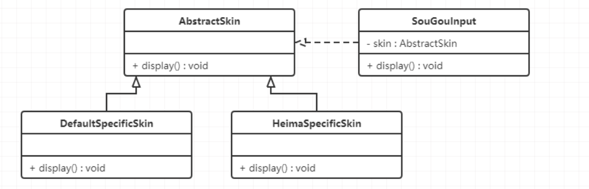
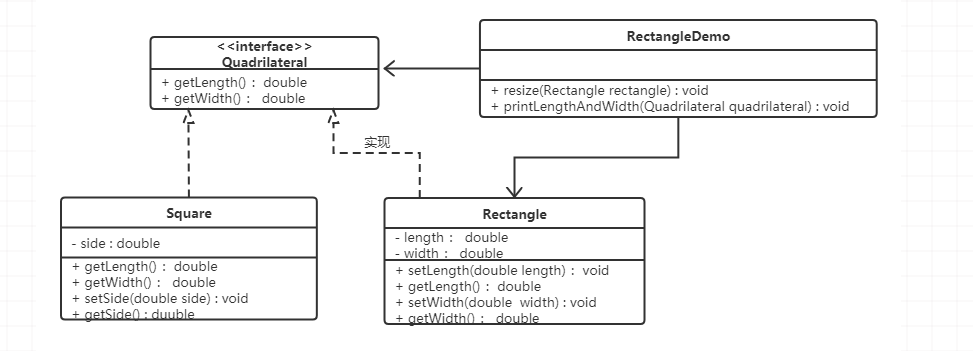
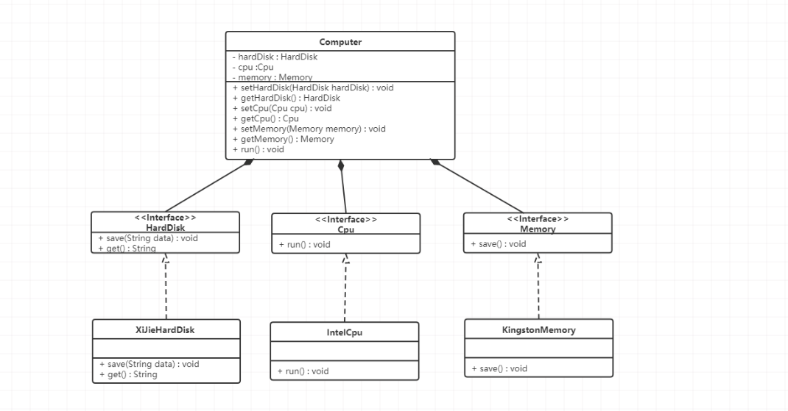
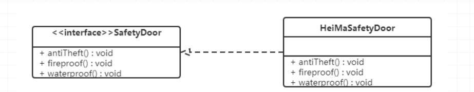
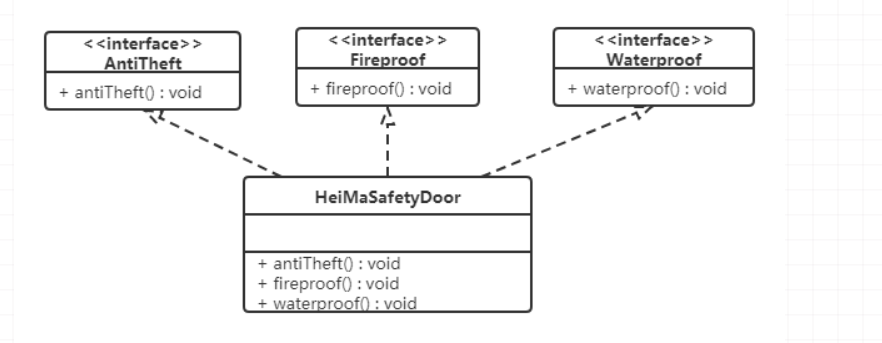
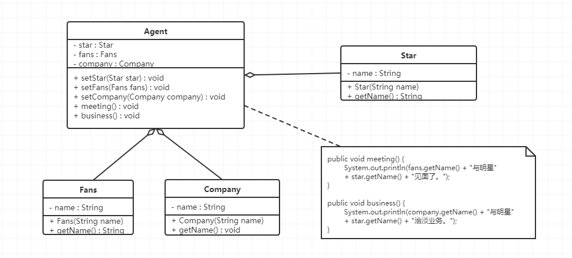
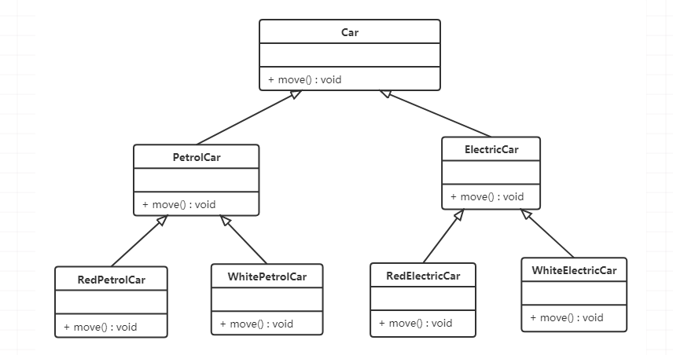
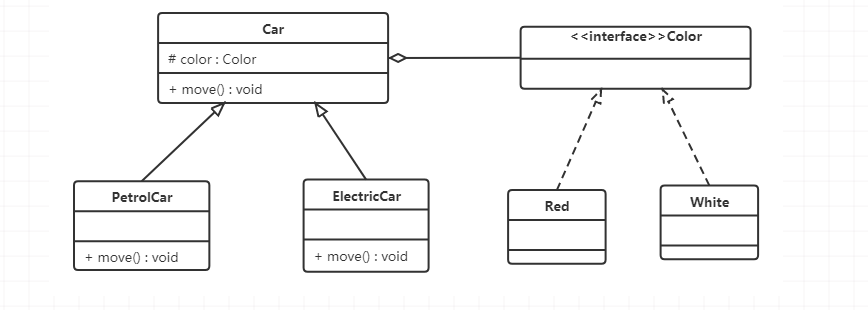

## 软件设计原则

### 开闭原则
**对扩展开放，对修改关闭。** 在程序需要进行扩展的时候，不能去修改原有的代码。

简而言之，是为了使程序的扩展性好，易于维护和升级。 想达到这样的效果，需要使用接口和抽象类

下面以 `搜狗输入法` 的皮肤为例介绍开闭原则的应用。

【例】`搜狗输入法` 的皮肤设计。

分析：`搜狗输入法` 的皮肤是输入法背景图片、窗口颜色和声音等元素的组合。用户可以根据自己的喜爱更换自己的输入法的皮肤，也可以从网上下载新的皮肤。
这些皮肤有共同的特点，可以为其定义一个抽象类（AbstractSkin），而每个具体的皮肤（DefaultSpecificSkin和HeimaSpecificSkin）是其子类。
用户窗体可以根据需要选择或者增加新的主题，而不需要修改原代码，所以它是满足开闭原则的。

### 里氏代换原则
任何基类可以出现的地方，子类一定可以出现。通俗理解：**子类可以扩展父类的功能，但不能改变父类原有的功能。**
换句话说，子类继承父类时，除添加新的方法完成新增功能外，尽量不要重写父类的方法。

如果通过重写父类的方法来完成新的功能，这样写起来虽然简单，但是整个继承体系的可复用性会比较差，特别是运用多态比较频繁时，程序运行出错的概率会非常大。

下面看一个里氏替换原则中经典的一个例子

【例】正方形不是长方形。

在数学领域里，正方形毫无疑问是长方形，它是一个长宽相等的长方形。
抽象出来一个四边形接口(Quadrilateral)，让Rectangle类和Square类实现Quadrilateral接口

### 依赖倒置原则
高层模块不应该依赖低层模块，两者都应该依赖其抽象；抽象不应该依赖细节，细节应该依赖抽象。简单的说就是要求对抽象进行编程，不要对实现进行编程，这样就降低了客户与实现模块间的耦合。

下面看一个例子来理解依赖倒转原则

【例】组装电脑

现要组装一台电脑，需要配件cpu，硬盘，内存条。只有这些配置都有了，计算机才能正常的运行。
选择cpu有很多选择，如Intel，AMD等，硬盘可以选择希捷，西数等，内存条可以选择金士顿，海盗船等。

代码我们只需要修改Computer类，让Computer类依赖抽象（各个配件的接口），而不是依赖于各个组件具体的实现类。

一般情况下抽象的变化概率很小，让用户程序依赖于抽象，实现的细节也依赖于抽象。
即使实现细节不断变动，只要抽象不变，客户程序就不需要变化。这大大降低了客户程序与实现细节的耦合度。

### 接口隔离原则
客户端不应该被迫依赖于它不使用的方法；一个类对另一个类的依赖应该建立在最小的接口上。

下面看一个例子来理解接口隔离原则

【例】安全门案例

我们需要创建一个`黑马`品牌的安全门，该安全门具有防火、防水、防盗的功能。
可以将防火，防水，防盗功能提取成一个接口，形成一套规范。类图如下：

上面的设计我们发现了它存在的问题，黑马品牌的安全门具有防盗，防水，防火的功能。
现在如果我们还需要再创建一个传智品牌的安全门，而该安全门只具有防盗、防水功能呢？

很显然如果实现SafetyDoor接口就违背了接口隔离原则，那么我们如何进行修改呢？看如下类图：

### 迪米特法则
迪米特法则又叫最少知识原则。

只和你的直接朋友交谈，不跟“陌生人”说话（Talk only to your immediate friends and not to strangers）。

其含义是：如果两个软件实体无须直接通信，那么就不应当发生直接的相互调用，可以通过第三方转发该调用。其目的是降低类之间的耦合度，提高模块的相对独立性。

迪米特法则中的“朋友”是指：当前对象本身、当前对象的成员对象、当前对象所创建的对象、当前对象的方法参数等，这些对象同当前对象存在关联、聚合或组合关系，可以直接访问这些对象的方法。

下面看一个例子

【例】明星与经纪人的关系实例

明星由于全身心投入艺术，所以许多日常事务由经纪人负责处理，如和粉丝的见面会，和媒体公司的业务洽淡等。
这里的经纪人是明星的朋友，而粉丝和媒体公司是陌生人，所以适合使用迪米特法则。

类图如下：

### 合成复用原则
合成复用原则是指：尽量先使用组合或者聚合等关联关系来实现，其次才考虑使用继承关系来实现。

通常类的复用分为继承复用和合成复用两种。

继承复用虽然有简单和易实现的优点，但它也存在以下缺点：

1. 继承复用破坏了类的封装性。因为继承会将父类的实现细节暴露给子类，父类对子类是透明的，所以这种复用又称为“白箱”复用。
2. 子类与父类的耦合度高。父类的实现的任何改变都会导致子类的实现发生变化，这不利于类的扩展与维护。
3. 它限制了复用的灵活性。从父类继承而来的实现是静态的，在编译时已经定义，所以在运行时不可能发生变化。

采用组合或聚合复用时，可以将已有对象纳入新对象中，使之成为新对象的一部分，新对象可以调用已有对象的功能，它有以下优点：

1. 它维持了类的封装性。因为成分对象的内部细节是新对象看不见的，所以这种复用又称为“黑箱”复用。
2. 对象间的耦合度低。可以在类的成员位置声明抽象。
3. 复用的灵活性高。这种复用可以在运行时动态进行，新对象可以动态地引用与成分对象类型相同的对象。

下面看一个例子来理解合成复用原则

【例】汽车分类管理程序

汽车按“动力源”划分可分为汽油汽车、电动汽车等；按“颜色”划分可分为白色汽车、黑色汽车和红色汽车等。
如果同时考虑这两种分类，其组合就很多。类图如下：

从上面类图我们可以看到使用继承复用产生了很多子类，如果现在又有新的动力源或者新的颜色的话，就需要再定义新的类。
我们试着将继承复用改为聚合复用看一下。

test1，这是第一次测试